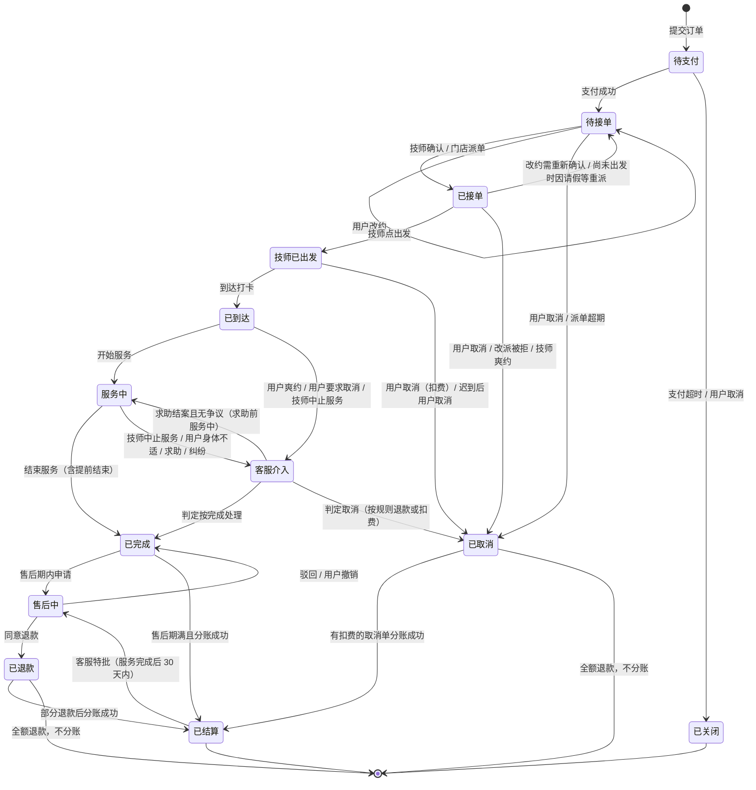

# 02 订单与履约

一期只有上门服务。这份文档覆盖一笔订单从下单到结束的所有正常和异常路径；每个状态下各角色看到什么、能做什么，见 [13-状态与操作矩阵](13-状态与操作矩阵.md)。

## 1. 订单状态

- **子状态**不单独建状态，用订单上的标记表示：待接单下的"门店派单中"；待接单或已接单下的"改派待用户确认"；已接单下的"改约待用户确认"；服务中的"加钟待支付"；退款的"退款中"和"退款待垫付"。
- **用户端看不到"已结算"**，这个状态仍显示为"已完成"；技师端显示"提成已结算"，门店显示"已分账"。
- 每次状态变化都写入 `order_event`，记录操作人、时间和位置。

## 2. 下单

1. 用户填写地址后，系统找出服务半径覆盖这个地址的门店，按距离排序。没有门店覆盖就提示"暂未开通"。暂停营业的门店不参与匹配（见 12 第 1 节）。
2. 客户归属的门店在范围内时，优先展示这家门店的技师。
3. 用户选项目，再选技师，有两种方式：
    - **指定技师**：用户自己选。
    - **就近安排**：系统在**付款前**选定一位具体技师（按距离、评分、当日单量排序），在确认页显示"为你安排：技师 X"。
4. 选时段，只显示可约时段（见第 4 节）。
5. **服务对象与健康告知**：
    - 服务对象可以不是下单人，填写服务对象的称呼和电话。下单人必须已经实名，并对告知内容负责。
    - 第一次下单弹出完整的健康告知；之后每单在确认页勾选"服务对象已满 18 周岁，且不属于禁忌人群"，不勾选不能提交。
    - 禁忌人群（示例，需专业人员审定）：孕期、急性损伤或骨折未愈、皮肤破损或传染性皮肤病、发热、严重心脑血管疾病、饮酒后。
6. 提交订单，锁定时段，用户在 15 分钟内支付。
7. 支付成功后引导用户订阅消息（接单、出发、到达、退款等）；用户不订阅，关键节点用短信通知（见 13 第 4 节）。

**一期项目价格默认值（集团后台可配置）**：

| 项目 | 预约时长 | 日间一口价 | 夜间一口价 |
| --- | --- | --- | --- |
| 肩颈放松 | 45 分钟 | 198 元 | 228 元 |

- 时段价按预约开始时间判定：在可预约的服务时段内，21:00 之前为日间价，21:00 起为夜间价。夜间起点与价格均可由集团调整。
- 确认页展示该时段的总价，提交时保存价格快照。之后调整价格不改变已有订单；已支付订单改约仍须满足第 6 节的同价限制。

## 3. 派单

1. 支付成功后进入"待接单"，技师要在接单时限内确认（默认 10 分钟）。
2. 技师拒单或超时，订单进入门店的待派单池（子状态"门店派单中"），由店长在店内选技师派单（见第 5 节）。门店派单成功后直接进入"已接单"，向技师和用户发通知，不再等待技师二次确认；指定技师改派仍须先完成第 5 节的用户确认。
3. **首次派单期限**：到期时间 = min（首次支付成功时间 + 30 分钟，预约开始时间 − 60 分钟）。到期仍未接单、门店仍未派单成功，就自动全额退款，并通知用户。进入待派单池、切换候选技师、重试或重复点击派单都不延长期限；服务端先校验是否到期，再执行派单，超期请求不能恢复订单。
4. 超过接单时限后技师再点接单，提示"已超时，订单已交给门店派单"，以服务端的状态为准。
5. 最早可约时间（默认当前 + 2 小时）保证派单期限一定晚于支付时间：约最早的时段，也有完整的 30 分钟给技师确认和门店派单。

**改约、改派后的派单轮次**：

- 首次轮以首次支付成功时间起算。用户或门店发起的改约，在用户确认、新约生效时开启新一轮：到期时间 = min（确认变更时间 + 30 分钟，新预约开始时间 − 60 分钟）。技师重新确认的 10 分钟也不能超过该轮截止；提议变更、选择时段或拒绝门店改约不提前生效、不改变原轮期限。
- 已接单且尚未出发的订单，因请假、停单、离职等被迫重派时，以系统将受影响订单移入待派单池的时间开启新一轮，到期时间 = min（进入派单池时间 + 30 分钟，当前预约开始时间 − 60 分钟）。该触发只记录一次，不能用重复审批或重复入池重新计时。
- 原单还在首次或改约派单轮、尚未派单成功时，指定技师改派的用户确认截止为 min（发起确认时间 + 15 分钟，当前轮截止）。用户确认不重开这一轮；门店切换候选、补派、重试或重复点击都不能延长当前轮期限。
- 原单已经接单、当前轮已完成后再发起指定技师改派，由用户确认使变更生效，并记录新轮起点与上述 30 分钟 / 开始前 60 分钟的到期时间；门店派单同时完成该轮，直接显示"已接单"，无需新技师再次确认。就近安排的已接单订单由门店改派成功时直接生效、直接进入"已接单"。
- 每轮记录起算时间、到期时间、触发原因和完成时间。到期尚未派单成功则自动全额退款；若新轮的开始前 60 分钟截止已经到达，不给予额外 30 分钟。所有确认和派单请求以服务端最新轮次和状态校验，旧请求不能恢复超期订单。
- 新轮只调整派单时限，不修改首次支付时间；最远可约、资金冻结期、分账强制日仍以首次支付时间计算。

## 4. 时段占用与并发控制

**占用的是整段时间，不只是开始时间点：**

> 占用区间 = [预约开始 − 前置路程缓冲, 预约开始 + 服务时长 + 后置路程缓冲]

- 一期的路程缓冲按门店统一设置一个固定分钟数（默认 30 分钟）；三期改为按两单地址的距离估算。
- 可约时段按 30 分钟切分展示。展示数据可以用 Redis 缓存，但**不能作为能否预约的判断依据**。
- 技师请假、停单、门店暂停营业的时段都不可约。

**占用记录 `slot_occupancy` 有三种状态：**

| 状态 | 什么时候 | 有效期 |
| --- | --- | --- |
| 锁定 | 用户提交订单，或改约、加钟提交时 | 支付或确认的时限，过期自动释放 |
| 占用 | 支付成功，或改约确认 | 直到订单结束或取消 |
| 释放 | 取消、关闭、改派、改约、过期 | — |

**并发规则：**

1. 写占用记录时，在同一个数据库事务里先锁住这位技师（`SELECT … FOR UPDATE`），再检查有没有和"锁定"或"占用"状态的记录重叠，没有重叠才写入。两个用户同时约同一位技师，只有一个能成功。
2. 超时关单要先调用微信关单接口。关单失败并且查询结果是已支付，就按已支付处理，不释放时段。
3. 支付回调要幂等：按商户订单号判断是否已经处理过，重复回调不重复记账。
4. 如果支付回调到达时订单已经关闭：时段还空着，就恢复占用、继续流程；时段已经被别人占了，就自动全额退款并通知用户。

## 5. 改派

| 场景 | 规则 |
| --- | --- |
| 指定技师的订单，店内改派给另一位技师 | 必须用户确认。用户拒绝或确认超时就全额退款；默认确认 15 分钟，尚未完成的派单轮须受第 3 节当前轮截止限制。确认后门店派单直接进入已接单，无需新技师二次确认 |
| 就近安排的订单，店内改派 | 不需要用户确认，只发通知；新技师必须符合用户的性别偏好 |
| 改派到其他门店 | 不允许。钱已经进了原门店的子商户；要换门店只能全额退款后重新下单 |
| 下单时就选了非归属门店服务 | 允许，属于"跨店订单"，按 03 第 3 节结算 |
| 技师请假、停单、离职，名下有已接订单 | 只把该技师名下"已接单、尚未出发"且受影响的订单移入待派单池，由店长改派，规则同上（见 12 第 2 节）；已出发、已到达、服务中和已完成的订单不自动改为待派单，不能继续服务的走中止服务或客服处理 |

- 改派时先占新技师的时段，成功后再释放原技师的时段，都在同一个事务里完成。
- 每次改派写入 `reassignment`：原技师、新技师、原因、操作人、用户确认结果。

## 6. 改约

| 事项 | 规则 |
| --- | --- |
| 谁能发起 | 用户在订单页发起；门店也可以发起，但要用户确认 |
| 什么时候能改 | 技师出发前（待接单、已接单）；出发后只能取消 |
| 次数 | 用户每单 1 次（默认）；门店发起的不计入 |
| 改时间 | 只能在原服务门店内重新选时段，可以换技师；新时段要满足最早可约，并且不晚于"支付时间 + 最远可约天数"（受分账 30 天冻结期约束，见 03 第 4 节） |
| 价格 | 只能改到同价的时段；价格不同的时段显示为不可选，提示"价格不同，请取消后重新预约" |
| 改地址 | 只能改到原服务门店的服务范围内，价格不变；超出范围提示取消后重新预约（出发前取消免费）；交通补贴按新距离重新计算 |
| 执行 | 用户确认后先锁新时段，成功后释放原时段，在同一事务里完成；订单回到"待接单"，由技师重新确认，并按第 3 节在变更生效时开启新一轮派单期限；技师拒绝或超时交门店派单，到期还没派出就全额退款 |
| 门店发起被拒 | 用户拒绝或 15 分钟内没确认，保持原约；门店无法按原约服务的，按门店原因取消，全额退款 |

每次改约写入 `reschedule`：原时间和技师、新时间和技师、原地址和新地址、发起方、用户确认结果。

## 7. 加钟

- **计价**：每个项目配置加钟单位（默认 30 分钟）和加钟价（默认按项目单价折算：项目价 ÷ 项目时长 × 加钟单位，取整到元）。每单最多加钟 2 次（默认）。
- **流程**：
    1. 服务中由用户或技师发起。
    2. 系统检查技师后面这段时间有没有被占：[当前结束时间, 当前结束时间 + 加钟单位 + 后置缓冲]。
    3. 检查通过，立即锁定这段时间，有效期 5 分钟（默认），同时生成加钟子订单让用户支付。
    4. 5 分钟内付款，锁定转为占用，主订单的服务结束时间顺延；没付款就释放。
- 加钟子订单付款到同一家门店的子商户，单独分账；佣金比例跟随主订单（见 04 第 3 节）。

## 8. 取消、迟到与爽约

以下都是默认规则，扣费比例和时间在集团后台可以改。

| 时点 | 发起方 | 规则 |
| --- | --- | --- |
| 待支付 | 用户 | 直接关闭 |
| 待接单、已接单（技师还没出发） | 用户 | 免费，全额退款 |
| 技师已出发、还没到达 | 用户 | 扣订单金额的 20%，其余退回。取消前弹窗显示扣费金额，扣费怎么分配见 03 第 6.3 节 |
| 预约开始后 15 分钟技师还没到达 | 用户 | 可以免费取消，全额退款 |
| 已到达之后 | 用户 | 不能自己取消，联系客服后进入"客服介入"，默认按"技师已出发后取消"扣费 |
| 技师到达后 15 分钟联系不上用户（用户爽约） | 技师发起，店长确认 | 按"技师已出发后取消"扣费；计入用户爽约次数（见 11 第 4 节） |
| 预约开始时技师还没出发，并且联系不上（技师爽约） | 门店 | 按门店原因取消，全额退款；计入技师考核（见 11 第 2 节） |
| 技师或门店其他原因取消 | 门店 | 全额退款 |

**技师未按时出发和到达的提醒：**

| 时点 | 动作 |
| --- | --- |
| 预约开始前 30 分钟还没点出发 | 提醒技师，通知店长 |
| 预约开始时还没出发 | 店长告警，店长可以联系技师或改派 |
| 预约开始后 15 分钟还没到达 | 告知用户可以免费取消，店长告警 |

## 9. 中止服务与提前结束

### 9.1 技师中止服务（用户原因）

适用情形：用户提出不当要求；醉酒或行为异常；辱骂、威胁；服务对象未满 18 周岁或属于禁忌人群；现场环境不安全。

1. 技师点"中止服务"，选择原因，可以补充说明，确认后就可以离开。有人身危险时先走一键求助（见 05 第 1 节）。
2. 系统通知店长和集团值班客服，订单进入"客服介入"，暂停分账。
3. 客服 24 小时内联系双方核实。
4. 判定结果：

    | 判定 | 退款 | 技师提成 | 用户 |
    | --- | --- | --- | --- |
    | 用户原因 | 不退款 | 按服务完成计算 | 进入黑名单（见 11 第 4 节）；涉及违法的报警 |
    | 不是用户原因 | 按没服务的时长比例退款，还没开始服务的全额退 | 按实际服务时长比例计算 | 不处理 |

### 9.2 用户提前结束

- **正常完成的时长要求**：记录的已服务时长不少于"预约项目时长 + 已支付加钟时长"，才可选择"正常完成"。未支付、已过期或已取消的加钟不计入。未满时长时该选项不可用，并提示还差多少分钟；前端提示和服务端校验使用同一口径。
- **用户要求提前结束**：技师点"结束服务"并选"用户要求提前结束"，订单正常完成，不自动退款。用户不满意可以在售后期内申请售后。
- **用户身体不适**：技师立即停止服务，点"中止服务"并选"用户身体不适"，订单进入"客服介入"；需要时走求助流程或拨打 120。默认按没服务的时长比例退款。

### 9.3 到达后用户要求取消

用户联系客服，订单进入"客服介入"，默认按"技师已出发后取消"扣费。

## 10. 全局参数

以下参数都可以在集团后台修改，括号里是默认值。

| 参数 | 默认值 | 约束 |
| --- | --- | --- |
| 支付超时 | 15 分钟 | — |
| 技师接单时限 | 10 分钟 | 实际确认截止不超过本轮派单截止 |
| 派单期限 | 每轮起算后 30 分钟与当前预约开始前 60 分钟的较早者 | 首次支付、新约确认、已接订单被迫重派的起算规则见第 3 节；候选变更和重试不延长 |
| 最早可约 | 当前时间 + 2 小时 | 不少于"派单期限 + 开始前 60 分钟"，也就是 90 分钟 |
| 最远可约 | 支付时间起 7 天 | 最远可约天数 + 售后期天数 + 10 天 ≤ 25 天（见 03 第 4 节） |
| 路程缓冲 | 30 分钟（前后各一段） | 门店可以在集团设定的范围内调整 |
| 改约次数 | 每单 1 次 | 只能在技师出发前改 |
| 改派、门店改约等待用户确认 | 15 分钟 | 尚未派单完成时，改派确认不超过当前轮截止；门店改约被拒或超时保持原约 |
| 加钟单位、次数、锁定时长 | 30 分钟、2 次、5 分钟 | — |
| 服务时段 | 9:00–23:00 | 非服务时段不接单，确保求助有人值班 |
| 夜间价起点、肩颈项目价格 | 21:00 起；日间 198 元、夜间 228 元 | 以预约开始时间判定，提交后价格快照不变；集团后台可配置 |
| 未出发提醒 | 开始前 30 分钟 | — |
| 出发后取消扣费 | 订单金额 20% | — |
| 迟到免费取消 | 开始后 15 分钟 | — |
| 爽约判定 | 到达后 15 分钟联系不上 | — |
| 中止服务核实时限 | 24 小时 | — |
| 售后期 | 服务完成后 48 小时 | 受上面"最远可约"那条约束 |
| 售后处理时限 | 门店 24 小时；用户确认门店结果 48 小时；集团裁决 48 小时 | 见 11 第 1 节 |
| 客服特批退款期限 | 服务完成后 30 天 | — |
| 评价期限、差评申诉期限 | 服务完成后 7 天、评价后 7 天 | — |
| 发票申请期限 | 服务完成后 90 天 | — |
