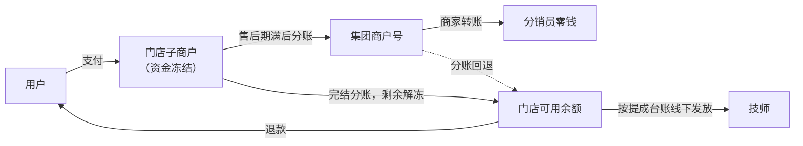

# 03 资金与结算

用户付的钱先进服务门店的子商户并冻结；售后期满后，按下单时的快照把集团那份分账给集团，其余解冻给门店。一期没有优惠券，分成基数就是用户实付，门店到账金额不会出现负数。

## 1. 资金路径

- 集团不代收代付，不存在"二清"问题。
- 分账只有"门店 → 集团"一个方向，所以集团**无法通过分账给门店补钱**。任何需要集团补贴门店的设计（例如集团券），都必须另有资金路径（见第 10 节）。

## 2. 分成公式（一期）

| 符号 | 含义 | 计算 |
| --- | --- | --- |
| S | 用户实付 | 一期没有优惠券，等于订单金额 |
| H | 集团抽成 | S × 集团抽成比例 |
| C | 分销佣金 | S × 佣金比例（有绑定的分销员并且符合条件时才有） |
| Cs | 门店承担的佣金 | C × 门店承担比例 |
| A | 分账给集团 | H + Cs |
| — | 门店到账 | S − A |
| — | 集团净收入 | H − (C − Cs) |

- 金额以"分"为单位，H 和 C 向下取整，零头归门店。
- 保存规则时校验：A ≤ S × 30%（微信分账默认的比例上限），所以门店到账至少是实付的 70%。
- 集团净收入可能是负数，例如集团出佣金、并且佣金比例高于抽成比例。这是集团的推广成本，钱从集团自己的账户付给分销员，资金路径是存在的。后台保存这种规则时要给出提示。

## 3. 抽成规则与跨店订单

- 抽成分两档：集团客户、门店客户，由客户归属决定（见 04 第 2 节）。
- 规则可以按全局、服务项目、门店、门店加项目来设；优先级：门店加项目 > 门店 > 项目 > 全局默认。
- 每条规则有生效时间。下单时把命中的规则写进订单快照 `order_split.rule_snapshot`，之后改规则不影响已下的订单。
- **跨店订单**指用户下单时选了非归属门店服务：按服务门店的"集团客户"档抽成；原归属门店不分钱；分销佣金照发，改由集团出；客户归属不变。付款后不允许改派到其他门店（见 02 第 5 节）。

## 4. 分账时序与冻结期

微信规定：分账资金从支付成功起默认冻结 30 天，30 天内没有发起分账的，会自动解冻给门店。所以整个流程必须在 30 天内走完分账。

| 节点 | 时间 | 动作 |
| --- | --- | --- |
| 支付成功 | T0 | 资金冻结 |
| 服务完成 | 最晚 T0 + 7 天（最远可约） | 生成技师提成台账，进入售后期 |
| 售后期满 | 服务完成后 48 小时 | 没有阻断条件 → 发起分账 → 完结分账 → 佣金转为"可提现" |
| 强制分账日 | T0 + 25 天 | 还没分账（被售后阻断或分账失败）→ 按当时的应得金额分账并完结 |
| 告警 | T0 + 27 天 | 还没成功 → 通知集团财务人工处理 |
| 自动解冻 | T0 + 30 天 | 微信把剩余资金解冻给门店；集团那份只能记入追偿台账 |

- 约束：最远可约天数 + 售后期天数 + 10 天重试余量 ≤ 25 天。后台修改这几个参数时要校验。
- 分账失败自动重试，间隔逐次拉长，最多 5 次，之后转人工。
- 分账、完结、回退请求都用唯一的商户单号，重复请求不会重复分账。

## 5. 售后阻断

- **阻断条件**：有没关闭的售后单（投诉、退款申请、纠纷），或有退款正在处理，或有没结案的安全事件，或订单处于"客服介入"（例如中止服务正在核实）。
- **阻断期间**：暂停分账和佣金结算，佣金停在"待结算"。
- **解除后**：售后单关闭时，如果售后期已经满了，立即发起分账。
- **到了强制分账日还在阻断**：扣掉已确认的退款后，按剩余金额分账；之后如果再退款，按第 7 节"分账后退款"处理。

## 6. 退款规则

### 6.1 全额退款

- 分账前：直接退款；集团抽成和分销佣金作废，技师提成台账作废。
- 分账后：见第 7 节。

### 6.2 部分退款

退款金额为 R 时：

- 新基数 S' = S − R，用下单时快照里的比例重新计算 H'、C'、A'。
- 分销佣金：部分退款**保留佣金**，按 S' 重新计算；只有全额退款才作废。
- 技师提成：默认按比例减少（× S' ÷ S）；门店可以设成"不减少"，差额门店自己承担。交通补贴不减少。
- 首单资格：部分退款的订单仍算首单，全额退款的不算。
- 每次调整写入 `split_adjustment` 和 `tech_commission_adjust`。

### 6.3 取消扣费

技师出发后用户取消，按 02 第 8 节扣费，扣费金额为 F（默认 S × 20%）：

- F 视为订单收入：集团抽成 = F × 当单的抽成比例。
- 不产生分销佣金，因为服务没有完成。
- 技师补偿 = F × 门店设定的比例（默认 50%），记入出发技师的提成台账。

### 6.4 中止服务

按 02 第 9 节的核实结果处理：

- **判定为用户原因**：不退款，视同服务完成，正常分账、正常结算佣金，技师提成按服务完成计算。
- **判定不是用户原因**，或用户身体不适：按没服务的时长比例部分退款，按第 6.2 节重新计算；技师提成按实际服务时长比例计算。
- 核实期间订单处于"客服介入"，暂停分账（见第 5 节）。

### 6.5 改约与加钟

- 改约只能改到同价时段（见 02 第 6 节），不产生资金变化；换了技师的，提成规则版本按新技师确认接单或门店派单生效时固定。
- 加钟子订单单独支付、单独分账；售后可以同时退主订单和已支付的加钟子订单，各笔分别按本节规则调整。

**协商退款总额的分笔规则**：

1. 用户分别填写每笔支付的申请退款金额 `Aᵢ`，均以分计，且不超过该笔尚可退金额（实付减去已退款金额）；申请为 0 的支付不参与分配。协商总额 `R` 必须在 0 至申请总额 `ΣAᵢ` 之间。申请总额为 0 时按"仅反馈"处理；协商退款总额为 0 时各笔退款为 0，均不发起支付退款。
2. 按每笔申请额占比分配：先计算 `R × Aᵢ ÷ ΣAᵢ`，各笔向下取整到分。剩余的分按小数余数从大到小逐分补齐；余数相同时，按主单在前、加钟支付时间及支付单号升序的固定顺序补齐。
3. 最终各笔金额之和必须等于 `R`，每笔不超过其申请金额或尚可退金额。提交协商时展示总额和分笔明细，用户接受后锁定该版本；直接同意申请总额时，各笔退款等于各笔申请额。
4. 按支付单分别发起幂等退款，使用已锁定的分笔金额；重试失败的一笔不重新分配总额，已经成功的一笔不重复退款。部分支付退款成功、其余处理中时，整体仍显示退款处理中，并保留各笔结果。

例如主单申请 98.00 元、加钟申请 49.00 元，协商退 100.00 元：先分为 66.66 元和 33.33 元，余下 0.01 元补给余数更大的主单，最终为 66.67 元和 33.33 元。分成、佣金、技师提成和发票净额按各笔实际退款结果分别调整。

## 7. 分账后退款、回退与追偿

分账后的退款来自两种情况：强制分账日之后才结束的售后（见第 5 节），以及已结算订单的客服特批退款（服务完成后 30 天内，见 11 第 1 节）。

1. **先退款**：从门店子商户余额退给用户，不等回退结果，用户不会因为回退失败而退不了款。
2. **门店余额不够**：退款失败时，订单标记"退款待垫付"，通知店长和集团财务。门店 24 小时内给商户号充值，系统自动重试；超时由集团财务决定是否线下垫付，并记入追偿台账。
3. **分账回退**：应回退金额 = 原分账金额 A − 重算后的 A'。
    - 集团抽成的差额，立即从集团回退给门店。
    - 门店承担的佣金差额，要等从分销员那里扣回后再回退；扣不回来的由门店承担。
    - 回退失败（集团余额不足）时重试并告警，同时记入追偿台账。
4. **佣金扣回**：分销员还没提现，就直接调减；已经提现了，就记为分销员的负余额，从以后的佣金里扣；90 天内扣不回来，转为损失，由这笔佣金的承担方承担，在追偿台账里结案。
5. **追偿台账** `recovery_ledger`：每笔记录类型、应付方、应收方、金额、来源订单、状态、处理人，每月对账一次。门店欠集团的钱，可以从这家门店以后订单的分账里追加扣回（仍受 30% 上限约束）。

## 8. 技师提成

- **基数**：门店选择按一口价（默认）或按实付计算。一期没有优惠券，两者相同。
- **固定时点**：技师确认接单（或门店派单）时，把门店当时的提成规则版本写进订单；之后门店改规则，不影响已接的订单。
- **换技师**：提成归实际完成服务的技师。被改派掉的技师没有提成；如果他已经出发，按门店规则给路费补偿。
- **取消补偿和部分退款**：见第 6 节。
- **记录**：每次调整写入 `tech_commission_adjust`（原因、金额、操作人）。门店每月按台账发放，在后台标记"已发"。

## 9. 算账样例

比例都只是示意：集团客户档 15%，门店客户档 5%，首单佣金 10%，技师提成 40%（按一口价），交通补贴 10 元，出发后取消扣 20%，技师取消补偿 50%。每一行都满足"用户实收 = 集团净收入 + 分销佣金 + 门店到账"。

| 样例 | 场景 | 实收（元） | 集团抽成 H | 分销佣金 C（谁出） | 分账给集团 A | 门店到账 | 集团净收入 | 技师提成 |
| --- | --- | --- | --- | --- | --- | --- | --- | --- |
| A | 同店。门店客户，技师甲推荐，技师乙服务，首单 | 298.00 | 14.90 | 29.80（门店） | 44.70 | 253.30 | 14.90 | 乙 129.20 |
| B | 集团客户（自然进入），首单 | 298.00 | 44.70 | 0 | 44.70 | 253.30 | 44.70 | 129.20 |
| C | 跨店。客户属于门店 X（技师甲推荐），门店 Y 服务 | 298.00 | 44.70（Y 的集团客户档） | 29.80（集团） | 44.70 | 253.30 | 14.90 | Y 的技师 129.20 |
| D | 技师出发后用户取消（集团客户），退 238.40 | 59.60 | 8.94 | 0 | 8.94 | 50.66 | 8.94 | 出发技师补偿 29.80 |
| E | 样例 A 服务后部分退款 98 元，分账前 | 200.00 | 10.00 | 20.00（门店） | 30.00 | 170.00 | 10.00 | 乙 90.00 |
| F | 样例 A 分账后退款 98 元，佣金还没提现 | 200.00 | 10.00 | 20.00（门店） | 原 44.70，回退 14.70 | 170.00 | 10.00 | 乙 90.00 |

- 技师提成由门店从到账金额里发放。样例 A 中门店最后留下 253.30 − 129.20 = 124.10 元。
- 样例 F 中，如果技师甲已经提现了 29.80 元：集团先回退抽成差额 4.90 元；佣金差额 9.80 元记为技师甲的负余额，扣回后再回退给门店，90 天扣不回来就由门店承担。

## 10. 二期优惠券方案

v0.1 的问题：集团券的成本从集团那份里扣，金额可能变成负数，比如 298 元订单用 50 元集团券、抽成 5% 时，集团净收入是 −35.10 元，门店应得 283.10 元，但子商户只收到 248 元，差额没有资金路径。二期这样改：

| 券种 | 微信产品 | 门店实收 | 分账基数 | 成本 |
| --- | --- | --- | --- | --- |
| 集团券 | 预充值代金券（集团出资） | 订单金额。微信把券的面额连同用户实付一起结算给门店 | 订单金额 | 集团充值时已经支出 |
| 门店券 | 免充值代金券 | 用户实付 | 用户实付 | 门店少收 |

- 上面那笔订单改用预充值代金券后：门店实收 298 元；抽成 5% 时分账给集团 14.90 元，门店到账 283.10 元；集团净收入 14.90 − 50 = −35.10 元，这是集团的营销支出，钱已经在充值时付过了。
- 上线前要和服务商确认：预充值代金券订单的分账基数和 30% 比例上限，是按订单金额还是按实付计算。

## 11. 发票

**用户发票**（默认由服务门店开，因为门店是收款方）：

1. 服务完成后 90 天内，用户在订单详情申请开票：选择个人或企业抬头，企业填写税号，填写接收邮箱。
2. 门店后台收到申请，开具电子发票并上传；用户在小程序里查看、下载。门店也可以驳回申请，但要写理由（例如抬头信息有误）。
3. 开票后订单又发生退款的，发票标记"待红冲"，门店红冲后按退款后的金额重新开具。
4. 金额：按用户实付金额（扣除退款后）开具；加钟子订单可以和主订单合并开票。

发票申请的状态：待开票 / 已开票 / 待红冲 / 已红冲 / 已驳回。

**集团服务费发票**：分账给集团的集团抽成属于平台服务费，集团每月按对账单给门店开票。门店承担、经集团代付给分销员的佣金怎么做账和开票，需要财务确认（见 10 第 2 节）。
