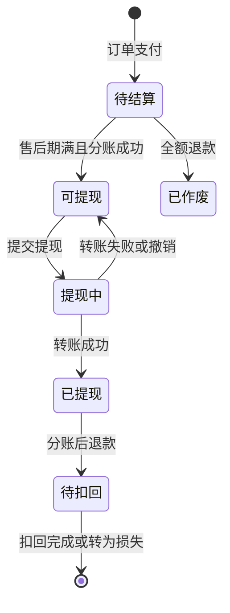

# 04 分销与客户归属

只做一级分销：A 推荐 B，B 消费后只有 A 拿佣金。客户归属决定集团按哪一档抽成，所以归属规则要覆盖所有边界情况。一期的分销员只限个人。

## 1. 分销员

| 类型 | 属于 | 奖励 | 阶段 |
| --- | --- | --- | --- |
| 技师 | 所在门店 | 现金佣金 | 一期 |
| 店员 | 所在门店 | 现金佣金 | 一期 |
| 门店推广员（个人） | 签约的门店 | 现金佣金 | 一期 |
| 集团推广员（个人） | 集团 | 现金佣金 | 一期 |
| 普通用户（老客带新客） | 和这个用户自己的归属一致 | 优惠券 | 二期 |
| 合作机构（健身房、月子中心、物业等） | 集团 | 对公结算 | 二期 |

- 多级分销违反微信规则，也有被认定为传销的风险，所以只做一级。
- 让技师当分销员是防止私下接单的主要手段：把自己的客户引到小程序下单能拿佣金，比私下接单更稳妥。

## 2. 客户归属规则

| 情况 | 规则 |
| --- | --- |
| 通过分销员的链接或二维码第一次进入 | 绑定这个分销员；归属 = 分销员属于谁；有效期 365 天（默认） |
| 扫门店二维码第一次进入 | 绑定门店，没有分销员 |
| 自然进入（没扫码） | 首单完成前是"未绑定"，这期间扫任何码都可以绑定；首单完成时仍未绑定 → 归属集团，有效期同上 |
| 下单时还没绑定 | 这笔订单按"集团客户"计，没有分销佣金；下单后再扫码绑定，不影响这笔订单 |
| 已绑定后又扫了别的码 | 有效期内不改绑，先绑先得 |
| 绑定到期 | 恢复"未绑定"；下一次扫码或下一笔完成的订单重新确定归属 |
| 分销员离职或停用 | 他的客户转给他所属的一方（门店推广员 → 该门店，集团推广员 → 集团），之后不再产生佣金；已经"可提现"的佣金照常可以提 |
| 技师调店 | 视同在原门店离职：客户留在原门店；在新门店生成新的分销身份 |
| 门店关闭 | 这家门店的客户转为集团客户；门店分销员的身份失效 |

- 下单时把客户当时的归属写进订单（`customer_type`、`owner_store_id`、`promoter_id`），之后归属变化不影响这笔订单。
- 每次归属变化写入 `customer_binding_history`：原归属、新归属、原因、时间。

## 3. 首单与复购

- **首单** = 用户第一笔"服务完成、并且没有全额退款"的主订单。
- 加钟子订单不单独算首单，佣金按主订单的比例（首单或复购）计算。
- 首单在售后期内被全额退款，首单资格回退，下一笔完成的订单算首单。
- 复购佣金只在绑定有效期内产生。

## 4. 佣金规则（后台可配）

- 按分销员类型设比例；首单和复购的比例可以不同。
- 按用户实付计算；售后期满、没有阻断才结算（见 03 第 5 节）。
- 全额退款，佣金作废；部分退款，按退款后的金额重新计算（见 03 第 6.2 节）。
- 佣金由谁出可以配置：集团、门店或按比例分摊；跨店订单固定由集团出。
- 保存规则时校验：集团抽成 + 门店出的佣金 ≤ 订单金额的 30%。

**佣金状态：**

## 5. 提现流程

1. **首次提现前**完成两件事：实名核验（姓名和身份证号要和微信实名一致）；开通商家转账的"免确认收款授权"（适合多次收款，用户授权一次，之后每笔不用再确认）。
2. **申请条件**：可提现余额 ≥ 提现门槛（默认 10 元），每天最多 3 次（默认）。
3. **防重复提现**：提交时，在同一个数据库事务里把对应佣金从"可提现"改成"提现中"，并关联提现单。重复点击按幂等键处理，只会生成一笔提现。
4. **发起转账**：调用商家转账，转账场景按微信实际批准的场景填写（例如佣金报酬类）。
5. **结果以最终状态为准**：根据回调或主动查询的结果判断，接口受理成功不算到账。

    | 转账结果 | 佣金处理 |
    | --- | --- |
    | 成功 | 改为"已提现" |
    | 失败 | 恢复"可提现"，记录失败原因 |
    | 撤销（用户没在有效期内确认收款，或商户撤销） | 恢复"可提现" |

6. **没有开通免确认授权的用户**，退回"用户确认收款"模式：用户在小程序里点确认收款，有效期内没确认就撤销。
7. **负余额**：被扣回的已提现佣金记为负余额，可提现余额 = 可提现佣金 − 负余额。
8. **个税**：个人佣金属于个人收入。一期按月汇总出报表交给财务申报；规模上来后接入灵活用工平台代发并代缴个税。
9. **合作机构**（二期）不走零钱，改为按月对账、对公打款、开发票。

**每日次数的默认计数口径**：

- 每名分销员每天最多创建 3 笔提现申请（一期默认值，集团后台可配置）。按 `Asia/Shanghai` 的自然日 00:00 至次日 00:00 统计，以提现申请创建时间归属日期。
- 在事务中成功创建提现单并锁定佣金时计 1 次，与每日上限校验和余额锁定一起执行，防止并发申请超限。首次处于待用户确认收款的申请也已计次。
- 申请创建后的转账失败或撤销仍占当天次数，恢复可提现余额不退回次数；重试或查询同一笔申请不另计次。
- 幂等重复点击不创建新单、不重复计次。实名、余额、金额或每日上限等前置校验失败，或事务未成功创建申请，不计次。次日计数从 0 开始，未完成的旧申请仍继续锁定对应佣金。

## 6. 分销员加入与推广方式

| 类型 | 怎么开通 |
| --- | --- |
| 技师 | 上岗时自动开通（见 12 第 2 节） |
| 店员 | 店长在门店后台添加，本人在小程序确认 |
| 门店推广员 | 门店发出邀请 → 本人在小程序签署推广协议、完成实名 → 生效 |
| 集团推广员 | 集团发出邀请 → 本人签署推广协议、完成实名 → 生效 |

- **推广协议**（文本需法务确认）至少约定：不做虚假宣传，不宣传疗效，不诱导分享，不私下收款；违反的取消分销资格，未结算的佣金作废。
- **推广方式**：带分销员参数的小程序码海报、小程序卡片分享。用户通过这两种方式进入，按第 2 节绑定。
- 分销员可以在推广中心看到自己绑定的客户数和佣金，看不到客户的手机号、地址等个人信息。

## 7. 防作弊

- 不能自己推荐自己；同一台设备、同一个手机号重复注册不算新客。
- 首单异常（下单后马上退款、同一个地址大量下单）自动标记，人工审核通过后才结算佣金。
- 分享文案不能诱导分享，比如"分享 3 个群领取"。
