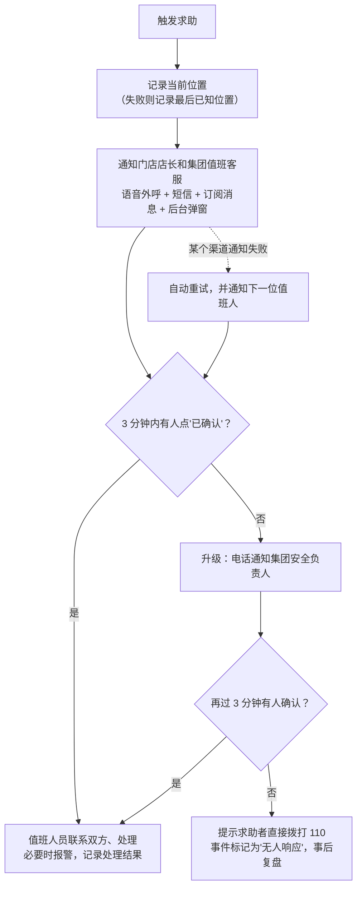

# 05 安全、合规与隐私

安全功能一期必须上线，每一项都要能按 [09-验收用例](09-验收用例.md) 验收。行踪轨迹、人脸、身份证号属于敏感个人信息，需要单独征得同意。

## 1. 一键求助

**入口**
- 技师端：从点"出发"到"结束服务"，全程可用。
- 用户端：从技师"出发"到服务结束后 2 小时内可用。
- 求助页面始终显示"直接拨打 110"按钮。

**处理流程**

- 每次通知的渠道、对象、结果都写入 `sos_notification`；每个事件的确认人、升级记录、处理结果写入 `sos_event`。
- **值班表** `duty_roster` 在集团后台配置。服务时段内必须有人值班；非服务时段不接单（默认 9:00–23:00），保证求助随时有人接。
- 安全事件没结案时，相关订单暂停分账（见 03 第 5 节）。

**求助与订单状态**

- 发起时记录求助前的履约状态、服务完成事实和完成时间。服务中发起求助后，订单立即进入"客服介入"；求助已升级、无人响应等是安全事件状态，不能把订单文案写回"服务中"。
- 结案时必须记录处理结果，并明确是否仍有未解决的服务争议。仍有争议的，继续"客服介入"或售后处理，分账保持暂停；安全事件结案不等于服务争议已处理完。
- 没有未解决争议、服务尚未完成的，恢复求助前的履约状态；求助前已经处于"客服介入"的，不能仅凭安全结案恢复履约，仍须完成对应核实。
- 服务已完成的，保留完成事实和原完成时间；无争议时显示"已完成"或订单当前更晚的有效状态，有争议时保留客服或售后处理。不得退回"已出发"、"已到达"或"服务中"，不得重新开始售后、评价和发票期限。
- 结案时以订单最新状态为准。求助期间已经完成退款、取消或其他终结处理的，不被记录中的旧状态覆盖。只有所有分账阻断条件均解除，才能按 03 第 5 节恢复结算。

## 2. 服务过程监护

- 技师端必须授权位置才能点"出发"。
- 从出发到结束，小程序在前台时定期上报位置；每个打卡节点都记录位置。
- **定位失败**：记录"定位失败"和最后已知位置，不阻断服务，订单标记为异常，值班人员能看到。
- **超时提醒**：过了预计结束时间 15 分钟还没打卡结束，提醒技师确认安全；再过 10 分钟没响应，按求助流程升级。
- 小程序退到后台后不能持续定位，所以一期只保证前台和打卡节点的位置记录；后台持续定位放到三期的技师端 App。

## 3. 实名、资质与保单

| 对象 | 要求 | 不满足时 |
| --- | --- | --- |
| 用户 | 第一次下上门订单前完成实名核验（姓名 + 身份证号） | 不能下单 |
| 技师入驻 | 人脸核身 + 证书核验 + 录入保单，集团审核 | 不能接单 |
| 技师保单 | 记录保险公司、保单号、保障范围、有效期；到期前 15 天提醒技师和店长 | 到期当天自动停止接单；已接的、服务时间在保期外的订单提醒店长改派 |
| 技师照片和介绍 | 统一工装，集团审核后才上架 | 不展示 |

**服务对象与用户行为**

| 事项 | 规则 | 详见 |
| --- | --- | --- |
| 未成年人 | 不为未满 18 周岁的人提供服务；下单时必须勾选确认；技师到达后发现是未成年人，可以中止服务 | 02 第 2 节、第 9 节 |
| 健康禁忌 | 下单前健康告知，禁忌人群不提供服务 | 02 第 2 节 |
| 用户违规 | 提出不当要求、醉酒、辱骂威胁时，技师可以中止服务并离开；核实后拉黑，涉及违法的报警 | 02 第 9 节、11 第 4 节 |
| 用户爽约、恶意退款 | 限制下单 | 11 第 4 节 |

是否限制异性服务，见 [10-分期计划与待确认](10-分期计划与待确认.md)。

## 4. 数据权限与保留期限

保留期限都是建议值，需要法务确认。

| 数据 | 类别 | 谁能看 | 保留期限 | 到期处理 |
| --- | --- | --- | --- | --- |
| 用户手机号 | 个人信息 | 技师看不到（走虚拟号码）；门店只看部分号码；集团客服能查完整号码，留操作日志 | 账号存续期间 | 注销后删除或匿名化 |
| 服务地址 | 个人信息 | 技师和门店只在订单进行中可见，完成后技师端隐藏 | 订单完成后 180 天 | 删除详细地址，只保留到区县 |
| 技师行踪轨迹 | 敏感个人信息 | 门店值班人员、集团安全人员 | 30 天；涉及安全事件的随事件保存 | 删除 |
| 身份证号 | 敏感个人信息 | 后台不显示明文 | 账号存续期间 | 注销后删除 |
| 人脸核身 | 敏感个人信息（生物识别） | 不存人脸图像，只存核验结果和流水号 | 账号存续期间 | 注销后删除 |
| 证书照片 | 个人信息 | 技师同意公开的部分对用户展示 | 在职期间 | 离职后下架 |
| 虚拟号码通话录音 | 个人信息 | 是否录音待确认；如果录音，通话前要告知 | 待定 | 待定 |

- 手机号、地址、身份证号加密存储；查看完整信息要留操作日志。
- 门店账号只能访问本店数据，接口和导出都按门店过滤（验收见 09）。

## 5. 告知与同意

- 隐私政策，加上第一次使用时的弹窗告知。
- **单独同意**：技师的行踪轨迹和人脸，用户用于实名的身份证号，都要单独弹窗同意。同意记录写入 `consent_record`（隐私政策版本、同意内容、时间）。
- 用户可以撤回同意，撤回后不能再用对应功能（例如不能下上门订单）。

## 6. 合规要求

| 事项 | 要求 | 产品和技术上怎么做 |
| --- | --- | --- |
| 小程序类目 | 营业执照经营范围要对得上；小程序和服务器域名需备案 | 用集团作为小程序主体；上线前先确认类目资质 |
| 形象与文案 | 技师照片统一工装，不拿外貌做卖点，文字不暧昧 | 照片和介绍由集团审核后上架 |
| 宣传用语 | 保健按摩不算医疗，不能宣传疗效（广告法） | 项目文案后台审核 + 敏感词校验 |
| 证书展示 | 确认是职业技能等级证书还是企业结业证书，措辞要准确 | 技师详情页展示证书编号，可查验 |
| 支付 | 集团不能先代收再转给门店（"二清"） | 服务商模式 + 门店子商户 + 分账 |
| 保险 | 技师意外险或雇主责任险，考虑服务责任险 | 没有有效保单不能接单 |
| 储值（二期） | 单用途预付卡有备案和资金存管要求 | 上线储值前单独确认 |
