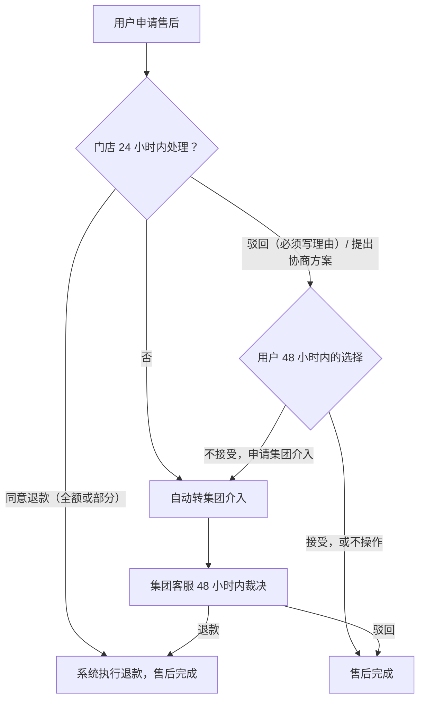

# 11 售后、客诉与评价

售后由门店先处理、集团兜底裁决，集团的裁决是最终结果；投诉成立会影响技师的接单资格；差评可以申诉；违规用户进黑名单，全平台生效。

## 1. 售后

### 1.1 受理

- **渠道**：服务完成后 48 小时内，在订单详情点"申请售后"。售后期过后，用户联系客服，集团客服可以在服务完成后 30 天内特批。
- **用户填写**：类型（服务质量 / 没按约定服务 / 时长不足 / 技师态度 / 其他）、诉求（退款金额 / 仅反馈）、描述、图片（最多 6 张）。
- **范围**：一次售后可以同时包含主订单和已支付的加钟子订单，用户分别填写申请额，各笔分别退款、分别调整分成。门店或集团给出协商总额时，按 [03 第 6.5 节](03-资金与结算.md) 拆分并展示各笔金额，用户确认后锁定该版本。
- 售后单一生成，这笔订单就暂停分账（见 03 第 5 节）。

### 1.2 处理流程

- 用户在售后完成前可以随时撤销申请。
- 集团的裁决是最终结果，门店必须执行（写进加盟合同）。
- 退款的执行和分成调整按 03 第 6–7 节。
- 技师能看到投诉内容，可以补充说明。

### 1.3 售后单状态

| 状态 | 用户看到 | 门店看到 |
| --- | --- | --- |
| 待门店处理 | 门店处理中，24 小时内回复 | 待处理，显示剩余时间 |
| 待用户确认 | 门店处理结果 + 接受 / 申请集团介入 | 等待用户确认 |
| 集团介入中 | 集团客服处理中 | 集团介入中，可以补充说明 |
| 已完成 | 结果（退款 ¥xx / 已驳回及理由） | 结果 |
| 已撤销 | 已撤销 | 已撤销 |

## 2. 投诉与技师处理

**投诉来源**：售后单、客服电话、中止服务的核实结果、安全事件。

| 等级 | 例子 | 处理 | 谁决定 |
| --- | --- | --- | --- |
| 一般 | 迟到、态度问题 | 警告，记入技师档案 | 门店 |
| 较重 | 技师爽约；30 天内一般投诉成立 3 次 | 停止接单 7 天，复训后恢复 | 门店提出，集团确认 |
| 严重 | 违规行为、安全问题、私下接单 | 立即停止接单并调查；成立则解约，必要时报警 | 集团，可以不经门店直接处理 |

- 技师对处理结果可以申诉一次，由集团复核。
- 停单期间技师不能接新单，名下受影响的"已接单、尚未出发"订单由店长改派；已开始履约的订单不自动退回待派单，必要时走中止服务或客服处理（见 02 第 5 节、12 第 2 节）。
- 每次处理写入 `technician_penalty`。

## 3. 评价

- 服务完成后 7 天内可以评价，每单一次，不能修改。加钟子订单不单独评价。
- 内容：1–5 星、标签（准时、手法专业、沟通好等）、文字（选填，机器审核通过后才显示）。
- **技师评分** = 近 90 天评价的平均分；评价少于 5 条时显示"新技师"，不显示分数。
- **差评申诉**：技师对 1–2 星的评价可以在 7 天内申诉一次 → 门店初审 → 集团终审。申诉成立就隐藏这条评价，不计入评分。
- 评价里有辱骂、泄露隐私等内容的，系统拦截或由集团隐藏。

## 4. 用户黑名单

| 情形 | 处理 |
| --- | --- |
| 技师中止服务，核实为用户原因 | 拉黑，全平台禁止下单 |
| 提出违规要求，或辱骂、威胁技师 | 拉黑；涉及违法的报警 |
| 30 天内用户爽约 2 次 | 限制下单 30 天 |
| 核实为恶意退款 | 限制下单 90 天 |

- 由门店提出、集团审核后生效；严重情形集团可以直接生效。全平台生效。
- 被限制的用户打开小程序会看到"账号已限制下单"、原因类别和到期日，可以通过客服申诉一次。
- 每条记录写入 `user_restriction`。

## 5. 客服渠道

- 小程序内"联系客服"（微信客服）和客服电话。
- 订单相关的问题先转给服务门店；门店处理不了或者用户要求，转集团客服。
