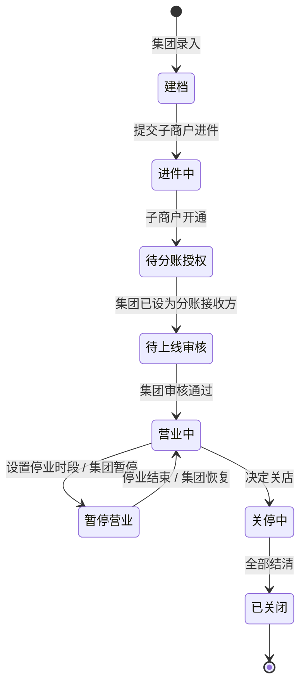
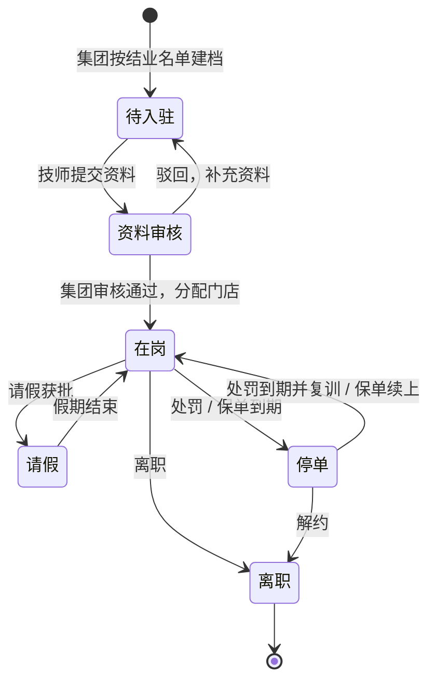

# 12 门店与技师管理

门店要完成进件、分账授权和集团审核才能接单；关店要等最后一笔订单的售后和追偿都结清。技师从结业建档到离职，每一步都决定他能不能接单，以及名下已接的订单怎么处理。

## 1. 门店生命周期

| 状态 | 能否接单 | 要完成的事 |
| --- | --- | --- |
| 建档 | 否 | 集团录入门店信息、营业执照 |
| 进件中 | 否 | 服务商代门店申请子商户：提交资料、微信审核、门店法人签约 |
| 待分账授权 | 否 | 门店在微信商户平台把集团设为分账接收方，比例上限不低于"集团抽成 + 门店承担佣金"的最高值 |
| 待上线审核 | 否 | 门店配置服务半径、营业时间、提成规则，至少有 1 名在岗、保单有效的技师；集团审核 |
| 营业中 | 是 | — |
| 暂停营业 | 停业时段内否 | 门店至少提前 24 小时设置停业时段；紧急情况集团可以立即暂停。停业时段内门店不参与匹配。已有订单由门店发起改约（用户确认），无法改约的按门店原因取消、全额退款 |
| 关停中 | 否 | 停止接新单；已有订单正常履约；等所有订单售后期满、分账完成、追偿台账结清；客户转为集团客户，门店分销员失效 |
| 已关闭 | 否 | 后台只读。子商户至少保留 90 天，用来处理延迟退款；这期间的退款从门店余额出，不够的记入追偿台账 |

## 2. 技师生命周期

| 环节 | 规则 |
| --- | --- |
| 入驻 | 集团按培训结业名单建档（一期手工导入）→ 技师用微信绑定账号 → 实名 + 人脸核身 → 上传证书、保单、工装照片 → 集团审核 → 分配门店 → 在岗，自动开通分销身份 |
| 请假 | 技师申请，店长审批。请假时段内有"已接单、尚未出发"订单的，店长要先改派或和用户改约，处理完才能批准。当天紧急请假（比如生病）店长可以直接批准，仅将这位技师名下受请假影响的"已接单、尚未出发"订单移入待派单池；不改变其他技师或不在请假时段内的订单。已出发、已到达、服务中和已完成的订单状态不自动变更，无法继续服务的走中止服务或客服处理 |
| 停单 | 处罚或保单到期时停单，不能接新单；名下受影响的"已接单、尚未出发"订单由店长改派；已开始履约的订单不自动退回待派单，必要时走中止服务或客服处理 |
| 调店 | 集团操作并设生效日。生效前在原门店接的订单在原门店完成；生效日起只接新门店的订单；分销身份按 04 第 2 节处理 |
| 离职 | 停止接新单 → "已接单、尚未出发"订单改派，已开始履约的订单正常完成或按客服流程处理 → 当月提成台账结清 → 分销身份失效（已可提现的佣金仍然可以提）→ 证书照片下架 → 账号转为普通用户 |
