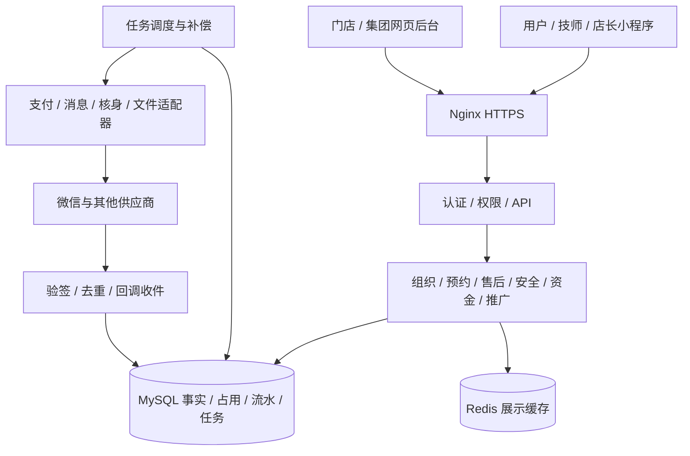

# 02 架构与接口规划

## 1. 技术建议和既有基线

| 层 | 方案 | 与 docs/08 的关系 |
| --- | --- | --- |
| 网页后台 | Vue 3 + TypeScript + Element Plus | 延续 Vue 3/Element Plus，补充类型约束 |
| 服务端 | Java 21 + Spring Boot，模块化单体 | 延续 Java/Spring Boot；具体维护版本和 SDK 兼容性在建工程时锁定 |
| 数据库 | MySQL 8 系列 InnoDB，优先核验 8.4 | 延续 MySQL；细分版本为建议 |
| 缓存 | Redis，可约展示、限流、会话辅助 | 延续；事务和唯一约束负责资源与资金正确性 |
| 任务 | 持久任务表 + XXL-JOB 触发与执行记录 | 延续 XXL-JOB；开发期可由内置调度扫描同一任务表，属于部署简化建议 |
| 文件 | 对象存储接口，私有附件和公开审核素材分开 | 原 COS；阿里云 OSS 为候选，厂商待定，接口隔离 |
| 接入 | 微信支付、定位、核身、号码保护、通知等适配器 | 延续原需求；获批能力和供应商需逐项核验 |
| 部署 | Docker/Nginx；阿里云联调环境 | 原文推荐腾讯云；现有阿里云部署事实用于本规划，生产采购另定 |

语言对比：Java 沿用资金需求基线和官方 SDK，优先推荐；Node.js/TypeScript 可减少跨语言协作，取决于团队经验；Go 可降低运行开销，但不能仅因当前主机内存小就切换业务栈。当前未确认语言替换。

一期保留单个业务服务，按模块组织代码。数据库事务覆盖订单、占用、快照和待执行事件；外部请求通过持久任务执行，避免长时间持有业务锁。

## 2. 模块边界

| 模块 | 负责内容 | 提供给其他模块的能力 |
| --- | --- | --- |
| identity | 小程序登录、后台登录、账号/角色、数据范围、同意 | 服务端身份及授权上下文 |
| organization | 门店/技师/证书/保单/调店/离职 | 当前可营业、可服务资格与历史隶属 |
| catalog | 项目、时段价、规则版本和文案 | 报价与规则快照 |
| availability | 片区与覆盖、偏好、排班/请假、缓冲和占用 | 可选资源、事务内占用/释放 |
| booking | 主单/加时、派单轮、改约/改派、开始/结束、取消 | 订单事实、操作许可和事件 |
| payment | 支付、退款、回调、查询补偿 | 每笔交易最终结果及退款额度 |
| settlement | 分成、分账/完结/回退、提成、账单/追偿 | 结算条件及实际流水 |
| promotion | 归属、首单、分销佣金、提现及负余额 | 下单归属快照、佣金与提现流水 |
| support | 售后、协商、裁决、中止、评价/处罚/黑名单 | 处理决定、退款方案与阻断原因 |
| safety | 求助、值班、通知升级、结案 | 安全事件与结算阻断 |
| invoicing | 申请、上传、红冲、净额 | 开票状态与文件访问权限 |
| operations | 消息、异步任务、审计、导出、指标 | 可追踪的执行记录和告警 |

例如退款由 support 决定金额、payment 执行到账、settlement 调整分成；后台不能直接修改某个“已退款”标记代替交易。

## 3. 接口规范

- 小程序 `/api/mp/v1/`；网页后台 `/api/admin/v1/`；微信通知 `/api/integrations/wechatpay/`。API 的 v1 是协议版本，与原型 V3/V4 区分。
- 普通接口统一返回 code、message、data、request_id；分页使用 page/page_size，导出异步返回任务号。渠道回调按渠道规定应答。
- 金额字段后缀 `_fen`，整数；比例 `_bp`，万分比。ID 按字符串传输，避免网页大整数精度问题。时间为 ISO 8601 带时区，内部存 UTC；业务自然日按 Asia/Shanghai。
- 写操作带 Idempotency-Key；同主体、路由和键唯一。同键同内容返回原结果，同键不同内容拒绝。使用 order_version、round_id、proposal_version 校验旧页面请求。
- 查询返回 server_time、deadline_at、version、allowed_actions，以及取消/退款预览。最终写入重新校验权限、事实、截止、余额和资源。
- 状态变化使用明确命令；后台通用编辑只能改获准的基础资料。财务、状态字段不对普通表单开放。
- HTTP 401 未登录、403 无权限、409 状态/占用冲突、422 业务校验；跨店资源可返回不暴露存在性的统一结果。异常日志关联 request_id，响应不含堆栈或敏感资料。

## 4. 首批小程序接口清单

下面为资源与命令规划，字段和错误样例在建工程前形成 OpenAPI 契约。

| API | 内容 | 核心检查 |
| --- | --- | --- |
| POST auth/wechat-login；GET me/roles | 微信身份、可切换身份 | code 服务端交换；返回实际获授身份 |
| GET regions、stores、stores/{id} | 手选区域、附近门店、详情 | 营业/停业、覆盖和可选项目 |
| GET services、technicians、availability | 项目、技师和可约时段 | 同店、资格、偏好、保单、排班、请假及占用 |
| POST booking-quotes | 服务端报价/候选技师及可取消规则预览 | 价格与规则版本；就近付款前确定具体技师 |
| POST orders；GET orders/{id} | 提交锁定、详情 | 实名/健康、真实覆盖、事务内占用、完整快照 |
| POST orders/{id}/payments | 生成支付参数 | 门店子商户、金额、分账标识、支付有效期 |
| GET orders；GET orders/{id}/events | 本人或获派记录及时间线 | 按授权角色和资源归属过滤 |
| POST orders/{id}/accept、reject | 技师确认/拒绝 | 本人、当前轮、确认截止、状态 |
| POST orders/{id}/assignments | 店长分配 | 本店、可用技师、本轮截止；成功直接确认 |
| POST orders/{id}/change-proposals | 提出改约/改派 | 原约保持，拟约资源锁定及同价/同店 |
| POST change-proposals/{id}/decision | 用户接受/拒绝 | 用户、提案版本、截止；接受事务内切换 |
| POST orders/{id}/start、complete | 开始/正常完成/提前结束 | 本人、事实、服务时长和已付加时 |
| POST orders/{id}/overtimes | 加时子单 | 次数、价格、剩余排班，5分钟占用 |
| POST orders/{id}/cancellation-quotes、cancel | 取消预览及执行 | 事实、原因、扣费依据、报价版本、退款净额 |
| POST aftersales；POST aftersales/{id}/decision | 售后申请及接受/升级 | 窗口、分笔申请额、已退和处理中占额 |
| POST sos-events；GET sos-events/{id} | 求助及进度 | 事件绑定订单、位置状态、自动升级 |
| GET/POST shifts、leaves | 本人排班/请假 | 完整起止时间、重叠及审批状态 |
| GET commissions；POST withdrawals | 佣金、申请提现 | 权限、实名、授权、余额、次数和幂等 |
| POST reviews、invoice-requests；GET对应详情 | 评价/发票 | 时间窗、一次评价、净开票额、访问权限 |
| POST verifications、consents、uploads；DELETE consents/{id} | 核验、同意、撤回、受控上传 | 服务端供应商结果、版本、关联用途、附件授权 |
| GET/POST contacts、addresses；POST account-closure-requests | 联系资料、原地址能力、注销 | 本人；V4地点入口待定；未结事项及留存规则 |
| POST promotion-bindings、promoter-agreements、transfer-authorizations | 归属、协议和提现授权 | 首绑/期限、身份资格、渠道授权结果 |

V3 的 depart/arrive 履约命令作为独立能力规划；V4 请求仅获取对应预约状态和允许动作。客户端传入版本不会获得额外业务权限。

## 5. 后台接口清单

后台与店长小程序共用业务命令服务，使用各自认证入口和响应字段。下表覆盖24个菜单。

| 接口组 | 查询 | 命令/任务 |
| --- | --- | --- |
| 工作台和预约 | dashboard、orders、orders/{id}、assignment-pool、candidates、events | assignments、change-proposals、no-show-decisions、cancel |
| 组织 | stores、onboarding、technicians、insurances、transfers、leaves | 建档、进件状态同步、审核、停业、关停检查、导入、调店/离职、审批 |
| 项目和规则 | service-items、price-rules、commission-rules、config-versions | 草稿、试算、校验、发布版本 |
| 售后和用户 | aftersales、terminations、complaints、reviews、appeals、restrictions | 协商/驳回/裁决、特批、核实、初/终审、限制审核/申诉 |
| 财务 | payments、refunds、profit-sharing、returns、recoveries、withdrawals、bills、differences | 按原单号查询/重试、差异处理、核销凭证、提成标记 |
| 发票和推广 | invoices、service-fee-statements、promoters、binding-history、agreements | 发票上传/驳回/红冲、邀请/停用、协议发布 |
| 安全 | sos-events、notifications、duty-rosters | 接报、结案、通知重试、值班配置 |
| 系统 | admin-users、roles、permissions、audit-logs、exports、jobs | 授权/停用、导出、同一任务重试/人工转派 |

所有列表、附件、导出和命令均使用相同授权范围；候选技师查询只是预览，分配提交时重新校验。

## 6. 交易、回调和任务

提交事务写订单、资源、快照及待执行事件；提交后调用外部渠道。回调先验签/解密并核对 appid、商户、子商户、单号、金额，再持久化去重并应用状态；正确落库后应答，失败按渠道机制重试。任务主动查询处理未知结果，确认到账后发布同一个业务结果事件。

本地状态用于记录业务处理，最终交易结果以有效渠道回调及查询核验为依据。重复结果只追加接收日志，不重复释放余额、退款、延长时长或计算佣金。请求超时先查询原单号，保留原交易号继续处理。

| 任务 | 持久截止/触发 | 并发及恢复要求 |
| --- | --- | --- |
| 支付关单 | 创建+15分钟；加时+5分钟 | 先关单/查询，结果未知时资源继续保留；晚付走重新占用或全退 |
| 技师确认超时/派单超期 | 本轮确认截止/固定派单截止 | 验证轮号；每轮自动退款只生成一次 |
| 提案超时 | 每个提案固定截止 | 指定改派全退；门店改约保持原约；过期拟约释放 |
| 完成监护、求助升级 | 预计结束+15/+25分钟；求助+3/+6分钟 | 通知各有记录，重启后补执行；业务按模式核验事实 |
| 售后/核实升级 | 门店24h、用户48h、集团48h、中止24h | 抢占任务时检查最新案件版本，迟到处理不能覆盖结果 |
| 结算、强制日、告警 | 售后期、每笔支付T0+25/+27天 | 逐笔核对已退和处理中金额；强制日仍阻断按03执行，未知退款先人工核验 |
| 退款/分账/回退/提现补偿 | next_retry_at | 用原号查询、同号重试，失败转人工；不重新分配退款方案 |
| 归属/资格/保单/停业生效 | 记录的生效/到期时点 | 只改相关资源，影响预约按受控命令处理 |
| 账单/清理/导出 | 业务日或保留期 | 差异入台账；争议留存例外，下载权限复核 |

任务按批抢占、带租约和执行记录；执行者退出后可恢复。调度有延迟时，命令仍按服务端真实时间拒绝过期动作，不依赖前端倒计时或定时器准点运行。

## 7. 官方资料核对

以下资料于2026-10-02查阅。具体补丁版本、支付产品权限和 SDK 组合需在接入时验证。

- Java 21 位于 Spring Boot 3.5 官方兼容范围内；采用3.x基线时以维护状态与依赖兼容性再确认版本：[Spring Boot 3.5系统要求](https://docs.spring.io/spring-boot/3.5/system-requirements.html)。
- 资源校验采用事务内锁定读取，普通 SELECT 不足以防并发冲突：[MySQL InnoDB锁定读取](https://dev.mysql.com/doc/refman/8.4/en/innodb-locking-reads.html)。
- 服务商下单须设置正确子商户和分账标识，分账资金及自动解冻见[微信支付合作伙伴下单说明](https://pay.wechatpay.cn/doc/v3/partner/4012738519)。
- 回调验签及处理按[微信支付合作伙伴支付通知](https://pay.wechatpay.cn/doc/v3/partner/4012886152)接入。
