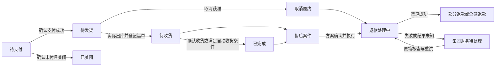

# 02 整合业务闭环

日期：2026-10-02。**业务评审稿；下文未标“已确认/承继”的新增规则均为建议。** 配套审查见 [01](01-旧商城审查.md)，决策与验收见 [03](03-场景验收与决策.md)。

2026-10-03 复审修复回写：下文标注“承继约束，Demo 已实现”的内容补充现有规则的执行边界；其他建议、待决策项及正式接入范围保持原标识。

## 1. 整合目标与使用者

同一位用户在同一小程序内预约服务、购买集团商品，能分别找到履约进度、售后和发票。店长安排服务并推广商品；集团负责商品经营及平台管理。角色入口、用户档案、组织、通知和客服可以共用，各业务的收款、履约和资金台账分别处理。

典型场景：陈女士通过 A 门店商品分享购买修复液，同时向 B 门店预约肩颈项目。集团履约商品订单并给 A 门店结商品佣金；B 门店收取预约款并安排技师。取消预约不会取消商品订单；退商品不会释放预约时段或改变服务客户归属。

不授权定位的用户仍能购物，并能手选预约区域。预约实名、成年和健康告知只在相应服务流程触发，不作为浏览商城的前提。所有状态均有文字说明，错误页保留返回、改选、重试或联系处理人的入口。

## 2. 三种“门店”必须分开

| 概念 | 作用 | 何时确定 | 后续变化 |
| --- | --- | --- | --- |
| 预约客户归属门店 | 决定预约客户档位及原个人分销关系 | 承继预约 365 天绑定规则 | 不因购物、定位或本次服务门店变化而改写 |
| 实际服务门店 | 预约收款、技师安排、服务售后和服务发票 | 预约下单时锁定 | 已付款不可跨门店改派，需退款后重下 |
| 商品推广门店 | 获取该笔商品推广佣金 | **已确认：按本次有效商品推广来源，下单锁定** | 后续换页面、扫码、门店改名不改历史订单 |

集团是商品销售、收款、库存、发货、商品售后和商品开票主体。集团自己的商品销售收入与应付推广佣金分别记录。

当前页面显示的门店、账户的客户归属、订单的推广快照不得互相代替。预约个人分销员、商品推广门店也不是同一个佣金收款人。

## 3. 角色、端和权限

保留三类小程序身份和两个网页后台。集团内部新增岗位权限，不另建一套商城登录体系。

| 身份 | 预约职责 | 商品职责 | 关键限制 |
| --- | --- | --- | --- |
| 用户 | 自己的预约、变更、服务售后 | 自己的购物车、地址、订单、商品售后 | 代填联系人不改变订单所有者；不能查看或取消其他用户订单 |
| 技师 | 本人预约、排班、请假、服务事实、收入 | 切换消费者身份购物 | 默认无商品经营、发货、退款权限 |
| 店长 | 本店派单、排班、服务售后和安全待办 | 商品推荐、推广码、本店推广订单和佣金 | 无库存、发货、商品退款权限；不默认获得完整收货地址/电话 |
| 门店财务 | 本店服务对账、提成及发票 | 本店商品佣金账单核对 | 收款主体是门店合同主体，不是店长个人 |
| 集团运营 | 门店、项目、人员和规则 | 商品、规格、上下架、佣金规则 | 改价改佣只影响新订单；不代替财务到账确认 |
| 集团仓储 | 无 | 库存、拣货、出库、物流、退货验收及裁决后的实物处置 | 不终审用户验收申诉，不裁定服务退款；商品退回不自动成为可售库存 |
| 集团客服 | 预约争议与升级处理 | 商品售后、验收申诉裁决、物流争议、投诉 | 裁决与仓储处置、退款执行结果分开 |
| 集团财务 | 预约分账、回退、追偿、个人提现 | 集团商品收退款、开票、门店佣金对账和付款 | 审批通过不等于付款成功；同一笔失败重试不可重复支付 |

列表、详情、操作和导出均按角色及数据范围过滤。Demo 的角色切换只改变当前身份，不替换客户数据、不复制历史资金。不同用户购物车和地址独立。

服务安全限制、商品购买限制、推广资格限制分别记录。已有订单的查看、履约、售后和退款不能因某项新限制失去出口。

**承继约束，Demo 已实现：**集团运营维护门店、项目和技师资料时，可以从影响清单查看关联预约的只读详情，范围限定为当前资料实际影响的在途预约。详情展示预约编号、项目、用户技师偏好、原约和待确认拟约时间，并标明技师是原约执行者还是待确认候选；不展示客户联系方式，也不授予运营预约经营命令。需要改约、改派或取消时，明确交接给门店负责人或集团客服；原有有权岗位保留“处理预约”入口。预约不再属于该资料的在途影响范围时，旧影响详情链接不继续开放。

## 4. 入口与订单中心

- 用户导航建议：**首页 / 预约 / 商城 / 我的**；购物车在商城内。
- 首页展示服务门店、预约项目和集团商品推荐，说明商品销售及履约主体。
- 我的订单分“预约订单 / 商品订单”；同一列表入口不强行共用状态。
- 店长小程序保留即时待办，增加推广与佣金摘要；复杂商品管理仍在集团网页后台。
- 用户咨询可从统一客服入口进入，但案件必须关联预约单或商品单，由对应责任方处理。
- 商品评价关联商品，服务评价关联预约及技师，评分不互相计入。

**承继约束，Demo 已实现：**已支付预约的“联系门店”提交普通协助事项，由本店店长、门店后台或集团客服回复并结案，用户可查看事项和回复。普通协助独立于安全求助，不套用“履约开始至结束后 2 小时”的安全求助时限，也不自动改变履约状态、创建安全事件或冻结结算。发生安全事件仍走原安全求助入口和升级流程；涉及争议或退款，须由相应业务流程另行处理，普通协助结案不能代替其结案。

旧商城的“到店预约→核销后扣会员资产”不能直接并入现有“先付预约款→安排技师→完成”的流程。首批整合以当前预约为主线；需要新增到店或会员卡履约时，必须另定适用服务类型和扣费时点。

## 5. 商品推广归因

### 5.1 用户已确认的核心规则

商品推广来源独立于预约客户归属；每笔订单在提交时锁定本次有效来源。自然进入且无有效记录时，集团自然销售、门店佣金为零。

### 5.2 为落实核心规则提出的边界口径

1. 只有有效的商品推广链接/码、或用户明确进入的门店商品推荐入口建立商品来源。定位、切换预约门店、打开订单详情不建立来源。
2. 建议首版采用一个购物上下文一个来源，最新有效推广入口替换尚未下单的来源；演示有效期建议 24 小时。此期限尚待确认。
3. 普通商城访问不立即清除尚有效的记录；退出登录/切换账号必须按用户隔离。过期、无效或被撤销的来源不自动回退到预约归属门店。
4. 同一个集团商城购物车可以合并商品，**本次结账统一采用确认页显示的来源**，不按各商品最早加购入口偷偷混算。来源由 A 变 B 时，在确认页明确提示；用户可返回原分享入口重新确定。若未来要求每行保留不同来源，则改成按来源分组下单，不能混用两种规则。
5. 提交后保存推广门店、来源标识、来源时间、资格及佣金规则版本。之后扫码只影响新的订单，支付旧单仍用旧快照。
6. 推广资格撤销后不建立新归因；已提交且仍在有效付款期限内的订单按锁定快照处理，历史已付有效订单继续结算。违规订单需独立核查、冻结和裁定，不能通过停用门店把历史佣金直接清零。
7. 首批商品佣金只结给推广门店；技师/店员可以帮助分享门店入口，个人奖励由门店另定。本规则是建议，不能隐含叠加旧个人分销佣金或区域代理佣金。

## 6. 商品从浏览到支付

| 步骤 | 执行者与校验 | 成功结果 | 失败/退出结果 |
| --- | --- | --- | --- |
| 商品发布 | 集团维护销售资格、SKU、价格、库存、配送区域、售后政策和佣金规则 | 用户可浏览购买 | 不完整不发布；已下架仍可在历史订单查看快照 |
| 加购 | 用户选择有效 SKU 和正整数数量 | 用户自己的购物车增加 | 数量超可售库存、商品下架明确提示；加购不预占库存 |
| 确认订单 | 校验账号、商品、数量、收货地址、配送区域、价格和推广来源 | 展示商品、运费、优惠、总价、集团主体、推广来源与售后条件 | 价格变化须重新确认；无地址/不可配送/缺货不能提交 |
| 提交 | 校验并锁库存；固定订单及规则快照 | 生成待支付订单，演示付款期限 15 分钟 | 重复提交复用同一笔；校验失败不产生扣款或库存残留 |
| 支付 | 对该订单付款；演示可选择成功/失败/处理中 | 成功后库存锁定转已售，进入待发货 | 失败可在有效期内重试；未知结果先查询，不能再创建新扣款 |
| 超时/未付取消 | 关闭原支付交易并核查最终状态 | 确认未付后关闭订单并释放库存 | 晚到已付先核实；无库存或已不能履约时走原路退款，不凭页面超时吞单 |

**库存规则**：可售数=可售实物库存−有效待支付锁定−已售待出库数量（或采用等价一致账本）；同一件不能分配给两笔有效订单。付款成功将待支付锁定转为已售待出库；未付关闭只释放待支付锁定；已付未出库取消释放对应已售待出库占用。出库同时扣实物库存并解除已售待出库占用，均只执行一次。已出库退款不等于退货入库，验收确认为可售才增加可售实物库存。所有数量变更能追溯到订单或盘点记录。

**快照规则**：提交前显示最新价格并提示变化，提交后有效期内保留价格。正常调价/下架不重写已付单。因商品安全等原因必须停售履约时，集团主动通知并取消退款，不能仅隐藏商品入口。

**收货地址**：允许新增、编辑和选择；下单保存地址快照。用户后来修改地址簿不改变已提交订单。发货前申请改地址须集团确认配送范围与费用；发货后由物流工单处理，不静默覆盖运单。收货地址不能自动视作服务地点。

## 7. 商品履约与状态

首版建议常规现货、一订单一次整单出库、一运单；未发货商品可按行取消退款，剩余商品再整单出库。需要拆包、补发或换货时建立关联包裹/售后任务，原订单金额与责任不丢失；若原型暂不提供拆包和换货操作，应明确入口范围，不能用改订单状态代替。

图中的退款、售后与履约是独立维度，展示聚合进度不覆盖实际出库、收货和完成事实。

| 维度 | 至少需要的状态/事实 |
| --- | --- |
| 商品履约 | 待支付、待发货、待收货、已完成、取消履约、未付关闭；下单/出库/收货时间 |
| 支付 | 未付、处理中、成功、失败/关闭；每笔渠道结果 |
| 售后 | 待受理、待用户确认、待寄回、退货运输中、待验收、争议处理中、待退款、已结案 |
| 退款 | 无、处理中、部分成功、全额成功、失败待处理；累计成功及占额 |
| 佣金 | 无需结算、预估、阻断中、可结算、已入账单、付款中、已付、已作废；冲减/追回单独追加 |

集团仓储出库时复验订单仍允许发货、库存及未决取消申请；取消和发货竞争只允许一个有效结果。必须登记物流公司、运单及出库明细。填写单号本身不证明收货。

物流停滞、丢件、错发和签收争议由集团客服建工单。争议未解不得自动收货或放开佣金。演示可提供模拟物流事件和明确的时间推进按钮，不用直接跳终态伪装完整链路。

## 8. 商品售后与退款

### 8.1 售后责任

商品售后由集团直接处理，推广门店协助。退款从集团商品收款渠道原路退，不要求门店垫付。受理时限、退货时限、运费责任和不同商品的可退条件需要单独制定，不能复制服务完成后 48 小时的预约规则。

| 场景 | 处理链路 | 业务与资金结果 |
| --- | --- | --- |
| 支付后未发货取消 | 用户申请→集团确认仓库未出库→取消相关履约→原路退款 | 停止对应发货、释放相应库存，退款结果独立展示 |
| 已发货仅退款 | 集团核实丢件等原因或协商→确认退款方案 | 已出库事实保留，不凭退款补库存 |
| 退货退款 | 申请商品/数量/原因→集团受理→用户寄回→集团验收→退款 | 验收决定可售/待处理/报损；退回件数与退款金额分别记录 |
| 部分商品/数量售后 | 锁定对应明细和金额→按约定方案执行 | 剩余商品继续履约，不能将整单粗暴改成已退款 |
| 验收不符/拒绝退货 | 记录证据、原因→用户申诉→集团复核→明确退款及货物处置 | 复核中保持待处理；全部/部分驳回时，记录需要返还用户的商品、寄回运单和运费承担；不能只结款不处理仓库中的货 |
| 用户超期未寄回 | 提醒→超时关闭本次案件，保留再次申请/客服处理条件 | 无退款则不写退款成功；已产生占额须按明确撤销方案释放 |
| 退款失败/结果未知 | 集团财务待办→查询→同笔重试或人工处理 | 原退款方案保留占额，不重复退款，不提前向用户显示到账 |
| 完成后特批退款 | 客服确认原因、授权范围与金额→财务执行→调整佣金/发票 | 保留履约事实和审批记录，不直接改实付金额 |

发货前部分取消的运费是否变化，在退款方案中明确给出，不事后追加未同意的收费。质量问题与用户原因的退货运费分别记录；额外补偿单独记费用，不混入商品退款导致错扣佣金。

退货复核部分接受或驳回后，已接收的货物必须逐项确定去向：验收入库、报损、返还用户或争议保管。返还运费责任、联系和领取期限、无法联系/无人领取的升级处理列入 D04；未形成可执行方案的货物保留集团客服与仓储待办，不擅自销毁、不恢复可售库存，也不假称全部售后已经办结。

**承继约束，Demo 已实现：**仓储初次验收发现不符时记录证据与说明，用户提出验收申诉后转集团客服裁决，仓储不能自行终审。客服同意退货后，货物仍由仓储登记可售入库或不可售报损，完成实物处置才进入财务退款；客服维持拒退后，仓储登记返还运单和运费承担，用户确认收到后关闭案件。客服裁决本身不增加库存，也不记录退款到账。

### 8.2 金额约束

- 每笔尚可退=实际支付−成功已退−已确认且仍在执行的退款占额。
- 明细商品退款总额不超过该明细实付；退货累计数量不超过购买数量。仅退款不伪造退货数量。
- 商品、运费、额外赔付分别列明；原价、优惠和实付分别保存。
- 并发申请、重复点击和失败重试均引用固定方案版本；已成功部分不再执行。
- 成功退款后更新商品净销售额、佣金净额与可开票额；到账失败时不假定净额已变。
- 原始支付和原始佣金不覆盖删除，通过退款和调整记录解释当前净额。

## 9. 商品佣金与门店结算

### 9.1 计算规则（建议）

佣金按商品明细计算，运费不计佣。每行佣金基数=该行商品实付−该行累计成功退款；比例使用下单快照。演示建议金额用整数分、比例用万分比，每行佣金=向下取整（净实付分×比例万分比÷10000），订单佣金为各行合计。

每次退款都按累计净额重算目标佣金，用上一次应得佣金与本次目标的差额生成调整，不能逐笔小额退款各自取整后累加。退款中的金额先冻结相应权益，最终成功才冲减。

示例参数不是正式费率：A 商品 200 元、佣金 10%；B 商品 100 元、佣金 20%；运费 10 元。

| 事件 | 用户净实付 | 商品佣金 | 资金处理 |
| --- | --- | --- | --- |
| 支付 310 元 | 310.00 | 预估 40.00 | 集团收款，尚不可结给门店 |
| A 退 100 元成功 | 210.00 | 净额 30.00 | A 10 元+B 20 元；不能按整单平均比例扣佣 |
| 原 40 元尚未付款给门店 | 210.00 | 可结 30.00（其余条件满足时） | 调整单冲减 10 元 |
| 原 40 元已付给门店 | 210.00 | 应保留 30.00 | 形成 10 元追回款；用户退款不等追回完成 |
| 再退运费 10 元 | 200.00 | 仍为 30.00 | 运费不参与佣金基数 |

自然来源或规则为零佣金的商品记“无需结算”，仍生成销售与退款流水。全额商品退款成功、净商品佣金归零时，未付权益记“已作废”，取消其等待收货/结算任务；已经付款的金额继续在追回记录中处理，不删除原付款。不能让这些订单永久停在预估。

个人预约佣金与商品门店佣金分账本，商品购买不占用预约首单资格。渠道资金回退、商品业务退款和佣金权益调整分别记录；只有明确的业务原因及金额才能减少门店应得佣金。

### 9.2 从预估到实际付款

1. 商品支付成功生成预估佣金；不因支付成功即可提现。
2. 满足已收货、约定售后等待期届满、相关退款/争议无阻断，才转为可结算。
3. 集团按约定周期出门店对账单，关联每笔商品佣金、退款调整及历史欠款抵扣。争议明细挂起，其余明细可继续。
4. 门店核对或提出差异，集团财务处理并固定账单。演示建议按月结算，具体日期另定。
5. 财务向门店合同主体付款；Demo 可模拟处理中、成功、失败。收款账户变更需核验，不能发给任意店长个人。
6. 付款结果未知时冻结该次付款金额；先查询再重试。再次审批不能制造第二笔付款。
7. 付款成功才记“已付”；失败返回可处理状态并保留原因、原交易号和账单关联。

**承继约束，Demo 已实现：**门店提出的账单差异单独记录原因、提出版本、核查结果和处理人。相关商品产生售后或退款调整时，可以更新账单金额与版本，但不能覆盖尚未核查的差异，也不能直接恢复门店确认或付款。集团财务完成差异核查后，未付款账单仍须由门店按新版本重新核对。已提交且结果未知的付款保留原交易，先查询渠道结果；差异核查不能将其改回可重复付款状态。

### 9.3 回退、追回与关店

| 原佣金位置 | 退款发生后的处理 |
| --- | --- |
| 预估/可结算 | 冻结待退部分，退款成功后冲减 |
| 已入账单但未付款 | 暂停受影响明细并出调整记录，不能在旧账单金额上继续付款 |
| 付款中、渠道结果未知 | 先查原付款；成功后按已付追回，失败后调整账单；不能同时恢复余额并再付款 |
| 已付门店 | 记该门店商品佣金债务，后续商品佣金抵扣或线下回款核销 |
| 无后续佣金/门店关闭 | 集团财务继续追偿；结案或损失核销须留决定与凭证，不删除记录 |

不未经约定从门店预约收款、技师提成或个人推广余额抵扣商品佣金债务。账面“应追回”不等于实际回款。

**承继约束，Demo 已实现：**每次回款登记使用独立的提交标识（`requestId`），同次登记重试复用该标识，金额和凭证内容一致时只记一次，内容不一致时拒绝覆盖。不同批次的真实回款使用新标识，即使填写相同说明，也分别累计；不能仅按说明文字去重。每笔金额不得超过登记时尚待追回余额，保留金额、凭证、登记时间和提交标识。

预约营业状态、商城推广资格、商品停售分别控制。关店停止新业务后，集团继续商品履约和售后；历史应付与应收保留。门店角色停用不取消集团财务的清算责任。

## 10. 预约业务承继与必须补齐的缺口

### 10.1 已有明确规则继续有效

- 门店成功派单直接确认；候选切换和重试不延长派单轮截止。
- 用户确认新约后新开一轮，截止取确认后 30 分钟和开始前 60 分钟的较早值；资金时间仍按原支付时间。
- 请假只重派受影响且允许重派的订单；已开始履约及已完成事实不回退。
- 正常完成须满项目及已付加时时长；提前结束单独处理，不自动退款。
- 主单/加时分别记录支付与退款；协商按各笔申请额分摊到分，确认后不因重试重分配。
- 求助结案不清除其他争议和退款结果；全部阻断解除后才恢复结算。

**承继约束，Demo 已实现：**

- 安全结案标明仍有独立服务争议时，必须单独保留与该安全事件关联的争议记录。服务中止退款成功只能结束其关联的中止争议；不能同时关闭独立服务争议或解除其结算阻断。旧存档中安全结案留有争议却缺少独立记录的，恢复待核实记录，不重放已成功退款。
- 退款方案每次调整生成新版本，保留总额、主单及各加时支付的分配明细、依据和处理人。用户确认须携带其看到的方案版本；旧页面或缺少版本的确认不批准新方案。确认时锁定版本、总额和分笔快照，失败重试及查询沿用原退款号和分笔金额，已成功部分不再执行。中止退款重新议定方案后，仍需用户明确确认。
- 订单与中止核实摘要统一引用当前关联退款：待确认时展示当前版本，已确认时展示锁定方案，成功后展示实际退款。原核实测算可以作为历史依据保留，须明确其历史性质，不能与现行方案并列为两个当前应退金额。
- 技师档案改变性别时，同时校验其原约和待确认候选承担的预约偏好；不符合任一在途承诺就拒绝保存，要求先协调预约再改档案。待确认候选仍占用资源期间必须出现在影响清单，不能只保护已正式派到该技师名下的订单。

### 10.2 地点与扣费依据不能继续只写“正式接入待定”

当前 v0.4 只保存匹配片区，真实地点确认尚未设计完成。为了业务闭环，建议：

1. **预约付款前**由用户提供并确认真实服务地点及联系人，按真实服务性质告知用途。Demo 用明确的示例信息模拟校验；不从商城收货地址自动复制为已确认地点。
2. 校验原门店覆盖、技师可服务范围与价格；无法服务则改选地点/门店，不能先扣款后无处理人。
3. 付款后地点变化由订单变更流程处理，重新核验覆盖、资源、价格和允许操作时点；跨店或变价按原规则取消重下。
4. 实际履约事实由获授权技师/门店记录，保留发生时间、记录时间和依据；后台补录必须可审计。
5. 用户取消时展示具体扣费原因、依据摘要、扣费额、退款额与申诉入口。存在事实争议则转客服核实，冻结相关结算；禁止仅凭用户不可知的后台标记直接改变已同意的退款方案。
6. 补录不得追溯改写已成功退款；需要另行处理的争议保留为新案件。

这是对旧缺口的业务建议，涉及页面和实际服务信息，**需要明确采集入口与事实责任人后才能称预约线已闭环**。不用隐瞒业务或审核切换来解决。

### 10.3 预约首单资格仍须定案

当前定义以首笔完成且未全退主单为首单，同时又要求下单固定佣金规则；并发订单、倒序完成和首单全退后是否重算后续单未定。

建议保存下单时首单/复购两档规则版本，在完成事件中按用户串行确定首单资格；售后期内首单全退时，转给最早满足条件的后续已完成主单，没有则等待下一笔。由此产生的金额变化追加调整记录；已付佣金不抹掉，按差额补结或追回。售后期外特批全退是否再回退资格须单独决定。商品订单始终不参与此判断。

## 11. 会员、补贴、代理、检测与直播

本次全部审查；是否一起进入下一版 Demo 尚待确认。每个纳入的模块至少必须满足以下条件，不能只保留扣款/入账按钮。

| 模块 | 必须定义的完整链路 | 不可直接继承的旧行为 |
| --- | --- | --- |
| 基础会员档案 | 注册/绑定→身份和所属组织→消费记录→权限→注销与必要留存 | 用全局 active 客户替代每笔业务的 customer_id |
| 开卡/储值 | 开卡支付→本金与赠送权益分别入账→消费→撤销/退款→权益追回→退卡清算 | 开卡收入和本金消费重复记销售；储值付款和微信付款共用不清晰实付字段 |
| 积分 | 明确积分种类→合格事件生成→可用/冻结→兑换或抵扣→逆向回收→过期 | 预约刚创建即发可消费积分，取消不回收；赠送和活动积分可任意混用于现金等价消费 |
| 套餐/赠送权益 | 购买或赠送→适用服务/门店/次数/有效期→预约锁次→完成核销→取消释放→退款清算 | 只有权益数量，没有锁定、使用与退回流程 |
| 100 期补贴 | 资金来源/承担者→参与资格与基数→真实期间→分期应付→审核发放→重复检查→消费退款调整→提前退出与终止 | 任意 periodKey 视为新一期；消费退款后基数、已发补贴和后续计划不调整 |
| 区域代理 | 签约→有效区域/门店/期限→佣金来源→规则快照→结算→退款追回→停用清算 | 协议页比例与实际计算硬编码不同；停用仍自动产生新收益；默认叠加在门店佣金之外 |
| 检测/设备 | 用户授权→建档/预约→设备与门店匹配→开始→结果校验→人工确认→发布→本人查看→纠错/复评 | 复用别的任务 resultId/门店/设备；未同意影像仍回传或发布；检测开始直接算服务已完成 |
| 直播 | 排期/开播/结束→有效商品或项目卡片→常规下单→订单跟踪→停播/停售出口 | 直播间价格、库存、门店或推广来源另成一套不受订单校验的状态 |

**储值资产须先分清发行主体**：集团储值用于门店服务时，需要集团对服务门店清算；门店储值用于集团商品时也有跨主体资金责任。当前没有确认发行主体、通用范围和退卡方式，不能直接启用“全平台余额通用”。

建议首批先实现普通微信商品支付和门店佣金；若决定全模块一起纳入，先补本节列出的资金及权益决策，再设计对应正反向场景。暂停或下期功能应移除会造成实际演示扣款的按钮，展示明确范围说明。

## 12. Demo 的闭环标准

1. 同一订单跨用户、门店和集团视图一致，刷新后仍能追溯原事实和金额。
2. 每个可点击业务动作都有资格、前置状态、执行结果、失败出口和记录。
3. 支付、退款、物流和设备可模拟，但必须模拟“处理中/失败/重试”，保留主流程和逆向流程。
4. 可推进演示时间，过期任务触发一次；不靠直接修改终态绕过应发生的动作。
5. 钱和资源守恒：不能超卖、重复扣款、超额退款、重复积分、无来源佣金或重复提现。
6. 权限从当前角色及业务归属判断；演示导航不能让“我的订单”变成全平台订单。
7. 新增建议及参数在评审文档标明；未经确认的资金权益不展示为已经确定的正式规则。

最终以 [03 的场景验收](03-场景验收与决策.md) 为准，页面数量和截图数量不代替闭环验收。
